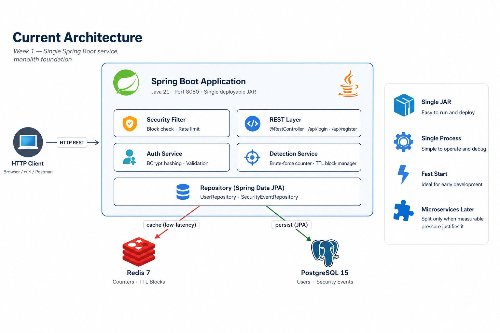
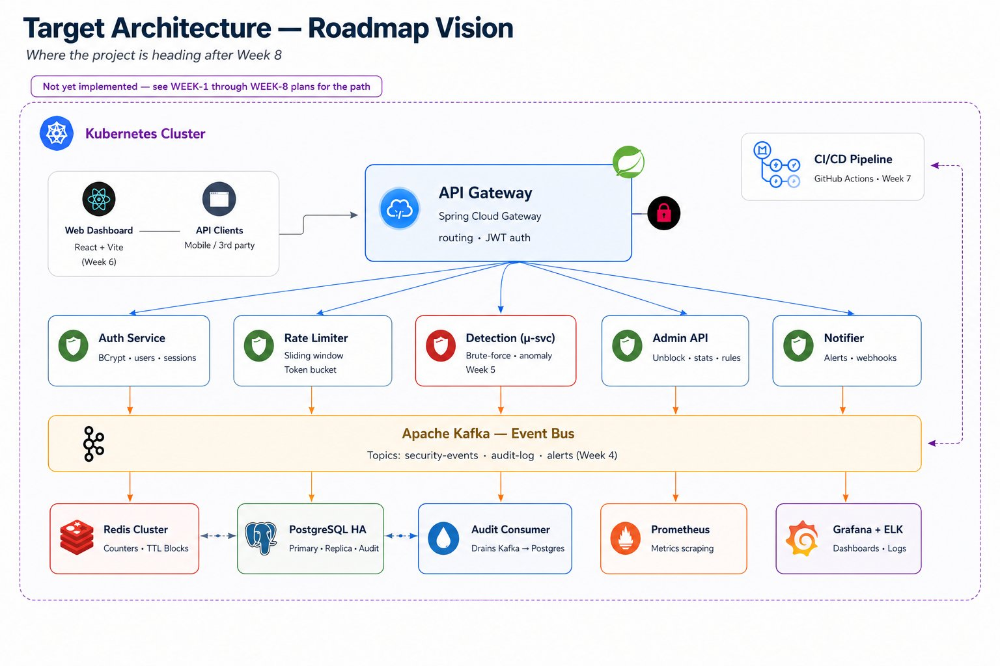

# API Traffic Guard

> A real-time API protection layer that detects and mitigates abusive traffic — rate-limit violations and brute-force authentication attempts — before it reaches your services.

[]()
[]()
[]()

---

## What problem does this solve?

Public APIs are constantly hit by automated abuse: credential-stuffing attacks against login endpoints, scrapers that ignore rate limits, and bots that exhaust backend resources. Most teams react too late — usually after a postmortem.

**API Traffic Guard sits between your clients and your services and acts before damage is done.** It tracks request patterns in Redis, detects threats based on configurable thresholds, and applies temporary blocks at the IP or user level with automatic expiration.

This is the same problem space that companies like Imperva, Cloudflare, and Akamai operate in — at a much smaller scale, but with the same core mechanics.

## Features

- **Rate limiting** with a Redis-backed sliding-window algorithm (configurable per endpoint)
- **Brute-force detection** — counts failed login attempts per user and per IP, blocks at threshold
- **TTL-based blocking** — temporary blocks that expire automatically; no manual cleanup
- **Admin REST API** — unblock users, view live statistics, manage rate-limit rules at runtime
- **Audit trail** — every security event persisted to PostgreSQL for analysis
- **Production-ready observability** — Prometheus metrics, structured logging, Spring Actuator health checks
- **Fully containerized** — `docker compose up` brings the entire system online

## Quick start

```bash
git clone https://github.com/EliorYomTov/api-traffic-guard.git
cd api-traffic-guard
docker compose up -d
```

The service is available at `http://localhost:8080`. Try it:

```bash
# Register a user
curl -X POST http://localhost:8080/api/register \
  -H "Content-Type: application/json" \
  -d '{"username": "alice", "password": "secret123"}'

# Login successfully
curl -X POST http://localhost:8080/api/login \
  -H "Content-Type: application/json" \
  -d '{"username": "alice", "password": "secret123"}'

# Trigger brute-force detection (run 11 times)
for i in {1..11}; do
  curl -X POST http://localhost:8080/api/login \
    -H "Content-Type: application/json" \
    -d '{"username": "alice", "password": "wrong"}'
done

# Eleventh request returns 403 — Alice is now blocked for 15 minutes
```

## Architecture

The project is built incrementally. Two diagrams below show **where it is today** and **where it is heading**.

### Current state (Week 1)

The current architecture is a **deliberate monolith** — a single Spring Boot application backed by Redis (real-time counters and TTL blocks) and PostgreSQL (durable audit log). All security checks happen in a request filter before the controller is reached, so blocked traffic never touches business logic.



This diagram is updated each week to reflect the actual state of the codebase. To see how the architecture looked at any past milestone, check out the corresponding Git tag (`week-1`, `week-2`, etc.).

### Target state (post-Week 8)

The plan is to evolve toward a microservices architecture with an event-driven backbone — but only when there is a measurable reason to add each piece. The diagram below shows the full vision at the end of the roadmap, **not the current state**.



The reasoning behind each addition — Kafka, microservices split, Kubernetes — is documented in [ARCHITECTURE.md](./ARCHITECTURE.md). The path between the two diagrams is the [Week 1–8 plan](./WEEK-1-PLAN.md).

## Tech stack

| Layer | Technology | Why |
|-------|-----------|-----|
| Language | Java 21 (LTS) | Latest LTS, virtual threads, modern language features |
| Framework | Spring Boot 3.4 | De-facto standard for Java backend services |
| Persistence | PostgreSQL 15 + Spring Data JPA | ACID, strong tooling, easy migrations with Flyway |
| Cache | Redis 7 | Sub-millisecond reads for hot-path checks |
| Security | Spring Security + JWT | Stateless authentication |
| Testing | JUnit 5, Mockito, Testcontainers | Real DB and Redis in integration tests |
| Build | Maven 3.9 | Standard for Java projects |
| Container | Docker + Docker Compose | One-command local environment |
| Observability | Spring Actuator + Prometheus | Production-grade metrics out of the box |

## Project status

This is an active learning project. Each week adds a new layer with a documented rationale.

- [x] **Week 1** — Monolith foundation: REST + Postgres + Redis + Docker Compose
- [ ] **Week 2** — Spring Security + JWT, integration tests with Testcontainers
- [ ] **Week 3** — Prometheus metrics, Grafana dashboard, structured logging
- [ ] **Week 4** — Kafka integration for async audit pipeline
- [ ] **Week 5** — Extract Detection service into a separate microservice
- [ ] **Week 6** — Frontend dashboard (React + Vite) showing live stats
- [ ] **Week 7** — CI/CD via GitHub Actions, Docker Hub publishing
- [ ] **Week 8** — Kubernetes manifests, Helm chart

### Future phases

Beyond Week 8, the project will deploy to AWS:

- **Phase 9** — AWS deployment: EC2 / ECS for compute, RDS for PostgreSQL, ElastiCache for Redis
- **Phase 10** — S3 for static frontend hosting, CloudFront CDN, Route 53 DNS
- **Phase 11** — Production observability: CloudWatch, AWS X-Ray for distributed tracing
- **Phase 12** — Infrastructure as Code with Terraform

Closed milestones are tagged in Git as `week-1`, `week-2`, etc., so any version of the project can be checked out and run.

## Repository layout

```
api-traffic-guard/
├── src/
│   ├── main/
│   │   ├── java/com/trafficguard/   # application code
│   │   └── resources/
│   │       ├── application.yml
│   │       └── db/migration/        # Flyway SQL migrations
│   └── test/
│       └── java/com/trafficguard/   # unit + integration tests
├── docker/
│   ├── Dockerfile
│   └── docker-compose.yml
├── docs/
│   └── ARCHITECTURE.md              # technical decisions & rationale
├── architecture-current.png         # current state — updated each week
├── architecture-target.png          # roadmap vision — final architecture
├── pom.xml
└── README.md
```

## Running tests

```bash
./mvnw test                # unit tests
./mvnw verify              # unit + integration tests (requires Docker)
./mvnw jacoco:report       # coverage report at target/site/jacoco/index.html
```

## Contributing & feedback

This is a portfolio project, but feedback and PRs are welcome. If something looks wrong or could be done better, open an issue — that conversation is the point.

## License

MIT — see [LICENSE](./LICENSE).
